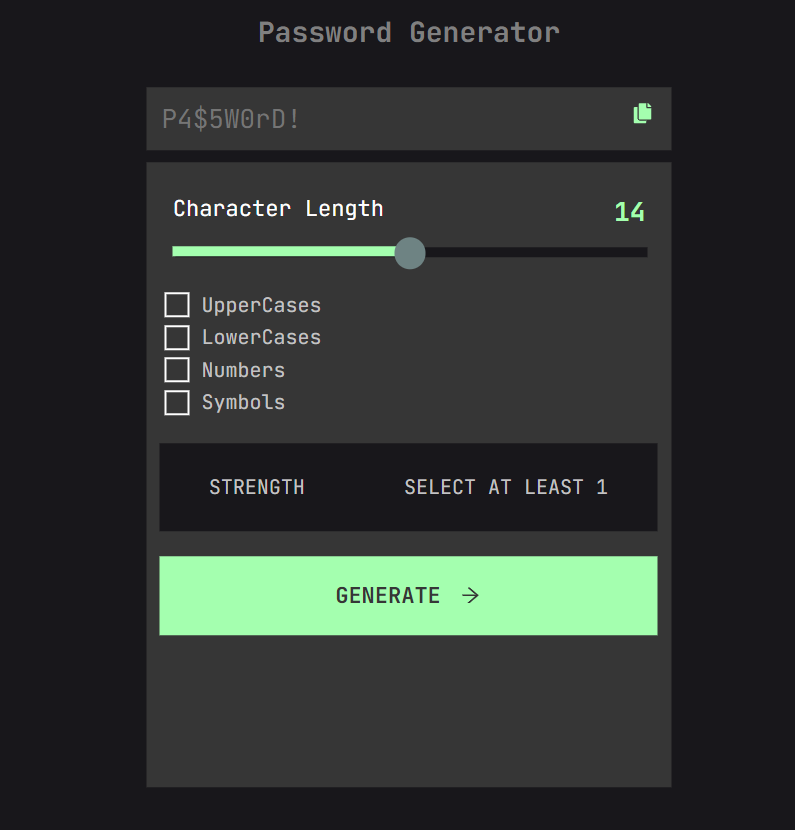
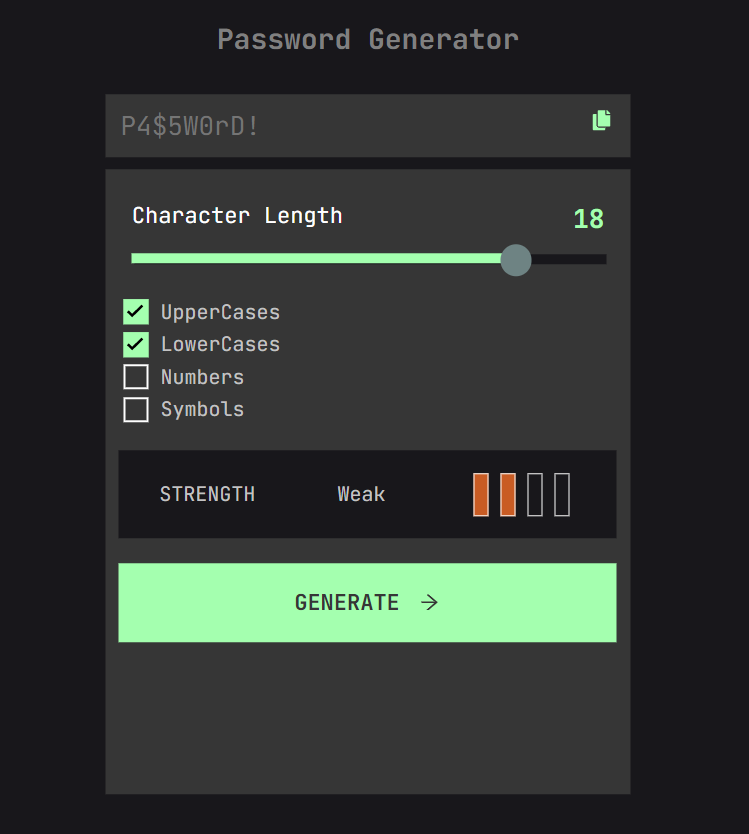
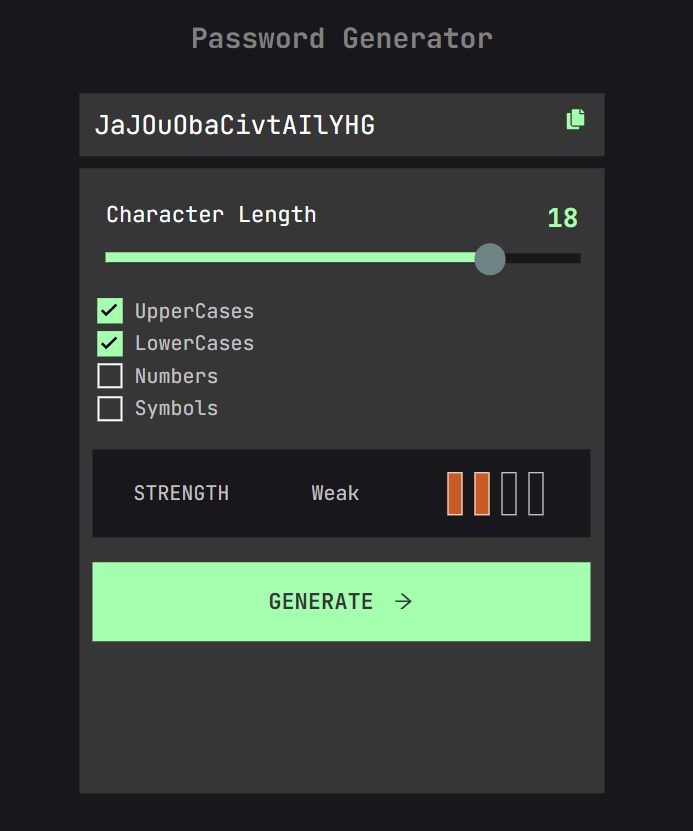
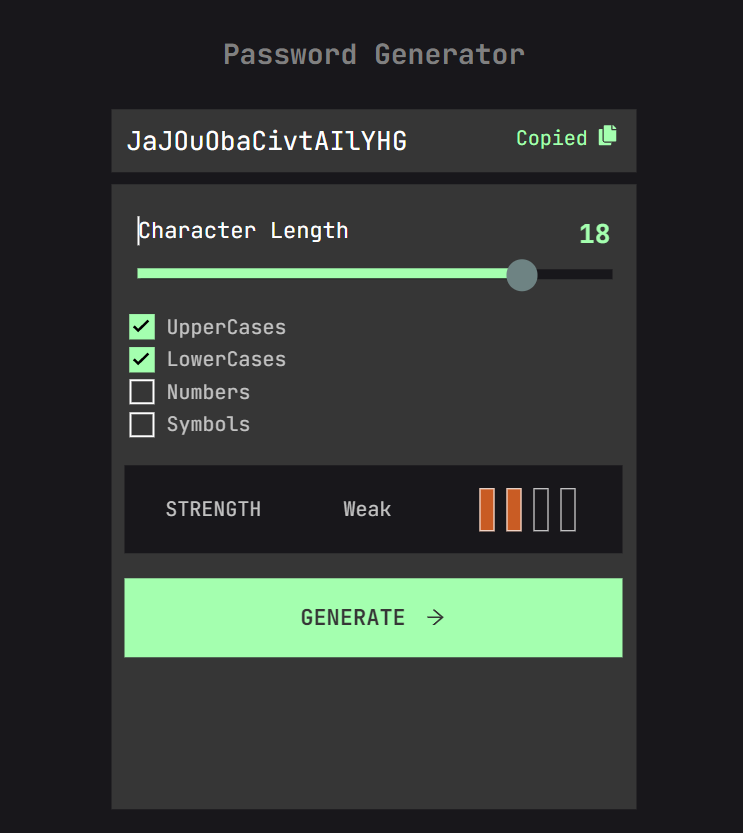

# Password Generator

#### Bu uygulama Frontend Mentor [challangelarından](https://www.frontendmentor.io/challenges/password-generator-app-Mr8CLycqjh) biridir.Password Generator kullanıcıya bellirli bazı özellikler seçtirip, bu özelliklere göre rastgele bir şifre üreten uygulamadır.  

 

## Metotlar ve Teknolojiler
### Uygulama React kütüphanesi ile yazılmıştır. Uygulamda styling için Sass ve svg türü ıconlar için React-Icon kütüphanesi kullanılmıştır.
### Uygulama rastgele şifre üretmek için uzunluk ve karakter türü gibi özellikler seçmemizi ister. Karakter türünden en az birini seçmemiz gerekir aksi takdirde şife üretilemez. Üretilen şifreyi copy iconuna basarak klavyeye kopyalabilirsiniz.

### Karakter türleri seçildikten sonra şifre üretilir duruma gelir.

### Generate butonuna basınca şifre üretilir.

### Şİfrenin sağında bulunan copy Iconuna basınca kopylanır ve uyarı olarak "Copied" yazısı çıkar.